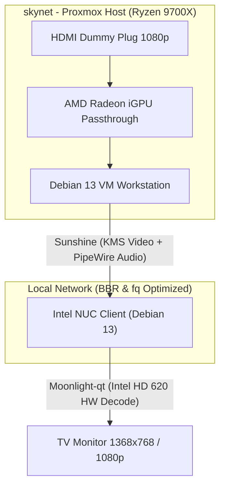

# 🎮 Headless Linux VM Gaming & Workstation Streaming Guide
## Low-Latency Sunshine/Moonlight Setup on Proxmox with AMD iGPU Passthrough

This repository provides an exhaustive, step-by-step engineering guide to deploying a headless Linux Virtual Machine (Debian 13 Trixie) on Proxmox VE, optimized for ultra-low latency desktop and game streaming via **Sunshine** to a **Moonlight** client (Intel NUC).

It covers host network tuning, VM operating system cleanup, GPU passthrough configurations, Wayland/KDE desktop optimization, and client-side performance adjustments.

## 📖 Table of Contents

1. [📐 Architecture & Topology](#-architecture--topology)
2. [🎛️ Step 1: Host Network Optimization (matrix & skynet)](#️-step-1-host-network-optimization-matrix--skynet)
3. [🏗️ Step 2: Guest VM OS Cleanup & Validation](#-step-2-guest-vm-os-cleanup--validation)
   * [A. Disable Virtual Hotplug Modules](#a-disable-virtual-hotplug-modules)
   * [B. Disable systemd SSH Socket Generator](#b-disable-systemd-ssh-socket-generator)
   * [C. Repair EFI FAT volume Dirty Bit](#c-repair-efi-fat-volume-dirty-bit)
   * [D. Update Initramfs](#d-update-initramfs)
4. [🖥️ Step 3: Graphical Environment & Autologin Setup](#-step-3-graphical-environment--autologin-setup)
5. [🎮 Step 4: Sunshine Installation & Hardening](#-step-4-sunshine-installation--hardening)
6. [💻 Step 5: NUC Client Latency Optimization](#-step-5-nuc-client-latency-optimization)
   * [A. Disable Wi-Fi Power Saving](#a-disable-wi-fi-power-saving)
   * [B. Configure CPU Energy Performance Preference (EPP)](#b-configure-cpu-energy-performance-preference-epp)
   * [C. Static Network Configuration (`/etc/network/interfaces`)](#c-static-network-configuration-etcnetworkinterfaces)
   * [D. Headless Wayland Kiosk Setup (via Cage Kiosk)](#d-headless-wayland-kiosk-setup-via-cage-kiosk)
   * [E. Input Device & USB Autosuspend Tuning](#e-input-device--usb-autosuspend-tuning)
   * [F. Moonlight Client Profile Settings](#f-moonlight-client-profile-settings)
   * [G. Audio Subsystem Stability (PipeWire & Power Saving)](#g-audio-subsystem-stability-pipewire--power-saving)

---

## 📐 Architecture & Topology



*   **Host Server (`skynet`)**: Custom ATX Tower, AMD Ryzen 7 9700X, 32GB DDR5, running Proxmox VE 9.2.3. Passes the onboard graphics (`79:00.0` VGA and `79:00.1` Audio) to the guest VM.
*   **Streaming Guest VM (`Workstation` - `fddf::XXXX` / `192.168.1.XX`)**: Debian 13 (Trixie), minimal KDE Plasma Wayland session, GPU-accelerated encoding via VA-API/Vulkan.
*   **Client Node (`Nuc` - `fddf::YYYY` / `192.168.1.YY`)**: Intel NUC7i3DNHE (i3-7100U, HD 620 GPU), running Moonlight-qt client over Wi-Fi.

---

## 🎛️ Step 1: Host Network Optimization (`matrix` & `skynet`)

To support high-bitrate video streaming and fast storage backups without introducing packet queueing delays (bufferbloat), TCP BBR congestion control and Fair Queueing are enabled on the Proxmox hosts.

1.  Consolidate and create `/etc/sysctl.d/99-homelab-network.conf` on both hosts:
    ```text
    # --- Network Buffer Optimizations (25MB Max) ---
    net.core.rmem_max = 26214400
    net.core.rmem_default = 26214400
    net.core.wmem_max = 26214400
    net.core.wmem_default = 26214400

    # --- TCP BBR Congestion Control & Pacing ---
    net.core.default_qdisc = fq
    net.ipv4.tcp_congestion_control = bbr

    # --- IPv6 SLAAC Router Advertisement ---
    net.ipv6.conf.all.accept_ra = 2
    net.ipv6.conf.default.accept_ra = 2
    net.ipv6.conf.vmbr0.accept_ra = 2
    ```
2.  Clean up any legacy files (`99-pve-firewall.conf`, `99-pve-ipv6.conf`) and apply the new configuration:
    ```bash
    sudo rm -f /etc/sysctl.d/99-pve-firewall.conf /etc/sysctl.d/99-pve-ipv6.conf
    sudo sysctl --system
    ```

---

## 🏗️ Step 2: Guest VM OS Cleanup & Validation

To achieve a clean, warning-free system boot and prevent initialization hangs, we clean up the VM boot sequence.

### A. Disable Virtual Hotplug Modules
Debian VMs under QEMU often log repetitive errors regarding virtual PCI hotplug failures.
1.  Disable the `shpchp` module loading via a dummy installation redirection:
    ```bash
    echo "install shpchp /bin/true" | sudo tee /etc/modprobe.d/blacklist-shpchp.conf
    ```

### B. Disable systemd SSH Socket Generator
If the VM lacks a virtual socket configuration, it will log errors at boot.
1.  Mask the generator by linking it to `/dev/null`:
    ```bash
    sudo mkdir -p /etc/systemd/system-generators
    sudo ln -sf /dev/null /etc/systemd/system-generators/systemd-ssh-generator
    ```

### C. Repair EFI FAT volume Dirty Bit
If the VM was shut down uncleanly, the EFI system partition logs filesystem dirtiness warnings at boot.
1.  Install DOS filesystem tools and scan the partition:
    ```bash
    sudo apt install -y dosfstools
    sudo fsck.vfat -a /dev/sda1
    ```

### D. Update Initramfs
Apply the modules configuration modifications to the boot ramdisk:
```bash
sudo update-initramfs -u -k all
```

---

## 🖥️ Step 3: Graphical Environment & Autologin Setup

For Sunshine to capture the display, a valid Wayland graphical session must run automatically on boot. We configure a minimal KDE Plasma desktop running on SDDM with passwordless autologin.

1.  **Install Minimal Desktop & Audio Stack**:
    ```bash
    sudo apt install -y --no-install-recommends \
      kde-plasma-desktop sddm xwayland \
      pipewire pipewire-audio wireplumber \
      xdg-desktop-portal-kde mesa-va-drivers mesa-vulkan-drivers
    ```
2.  **Configure SDDM Autologin**:
    Create `/etc/sddm.conf.d/autologin.conf` to automatically log in the user `tuco` directly into the Wayland session:
    ```ini
    [Autologin]
    User=tuco
    Session=plasma
    ```
3.  **Add User to Input Group**:
    Allow the streaming user to emulate mouse and keyboard events:
    ```bash
    sudo usermod -a -G input tuco
    ```

---

## 🎮 Step 4: Sunshine Installation & Hardening

1.  **Download and Install Sunshine**:
    ```bash
    wget -O /tmp/sunshine.deb https://github.com/LizardByte/Sunshine/releases/latest/download/sunshine-debian-trixie-amd64.deb
    sudo apt install -y /tmp/sunshine.deb
    ```
2.  **Apply Capabilities for Low-Latency Real-Time Capturing**:
    Enable raw KMS screencasting and high scheduling priority without executing Sunshine as `root`:
    ```bash
    sudo setcap cap_sys_admin,cap_sys_nice+p $(readlink -f $(which sunshine))
    ```
3.  **Configure Sunshine (`/home/tuco/.config/sunshine/sunshine.conf`)**:
    ```text
    capture = kms
    min_log_level = info
    address_family = both
    origin_web_ui_allowed = lan
    csrf_allowed_origins = https://[fddf::XXXX],https://192.168.1.XX
    ```
    *Note: Replace ULA `fddf::XXXX` and local IP `192.168.1.XX` with your VM's network parameters.*
4.  **Auto-Discovery (Avahi Setup)**:
    Install Avahi so Moonlight clients can automatically discover the VM:
    ```bash
    sudo apt install -y avahi-daemon
    sudo systemctl enable --now avahi-daemon
    ```
5.  **Enable the Sunshine systemd User Service**:
    ```bash
    systemctl --user enable --now app-dev.lizardbyte.app.Sunshine.service
    ```

---

## 💻 Step 5: NUC Client Latency Optimization

To eliminate client-side video decoding lags and network jitter on the Intel NUC client (NUC7i3DNHE, Intel Core i3-7100U, HD Graphics 630) running Debian 13 Trixie (Headless):

### A. Disable Wi-Fi Power Saving
Ensure the wireless interface (`wlp1s0`) never enters low-power sleep states during streaming:
```bash
sudo iw dev wlp1s0 set power_save off
```

### B. Configure CPU Energy Performance Preference (EPP)
Under the `intel_pstate` active scaling driver, the CPU's internal Hardware P-States (HWP) are controlled via the EPP register. To eliminate frequency ramp-up latency while keeping idle temperatures stable (avoiding locking the frequency to absolute maximum at all times), set the EPP profile to `balance_performance`.

Make this configuration persistent at boot via `systemd-tmpfiles`.

1. Create `/etc/tmpfiles.d/cpu-epp.conf`:
   ```text
   w /sys/devices/system/cpu/cpu*/cpufreq/energy_performance_preference - - - - balance_performance
   ```
2. Apply the rule immediately:
   ```bash
   sudo systemd-tmpfiles --create /etc/tmpfiles.d/cpu-epp.conf
   ```

### C. Static Network Configuration (`/etc/network/interfaces`)
To guarantee persistent, conflict-free connectivity on boot, configure `/etc/network/interfaces` for static dual-stack IPv4/IPv6 using the native `ifupdown` tool. Ensure all SSID/password fields with special characters (like `*`) are explicitly quoted to prevent parsing failures:

```text
source /etc/network/interfaces.d/*

# The loopback network interface
auto lo
iface lo inet loopback

# Primary Wi-Fi Interface configuration
auto wlp1s0

# IPv4 Static Configuration
iface wlp1s0 inet static
        address 192.168.1.YY
        netmask 255.255.255.0
        gateway 192.168.1.GW
        dns-nameservers 1.1.1.1 9.9.9.9
        wpa-ssid "Maison"
        wpa-psk  "Eliculolaop38*"

# IPv6 Static Configuration (Link-Local Gateway scoped to interface)
iface wlp1s0 inet6 static
        address fddf::YYYY
        netmask 64
        gateway fe80::GATEWAY_MAC%wlp1s0
        dns-nameservers 2606:4700:4700::1111 2001:4860:4860::8888
```

*Note: Restarting the network or transitioning from dynamic leases requires killing legacy DHCP processes and flushing the interface to apply the static parameters cleanly:*
```bash
sudo pkill -9 dhclient
sudo ip addr flush dev wlp1s0
sudo systemctl restart networking
```

### D. Headless Wayland Kiosk Setup (via Cage Kiosk)

Using raw EGLFS directly on the physical console TTY from within a Flatpak sandbox is structurally blocked. Flatpak's sandbox proxy isolates D-Bus and blocks the File Descriptor (FD) passing required by `systemd-logind` to hand over the DRM Master lock to a non-root user. 

To bypass this without compiling from source, the standard and verified solution is to run the native, ultra-lightweight **Cage Wayland Kiosk**. Because `cage` runs natively on the host, it handles the VT graphics mode switch and DRM initialization cleanly. Moonlight then runs inside it over Wayland with **Direct Scanout** (bypassing compositor buffering to achieve 0ms latency identical to EGLFS).

1.  **Install Cage Kiosk**:
    Install the lightweight kiosk compositor natively on the NUC host:
    ```bash
    sudo apt update && sudo apt install -y cage
    ```

2.  **Apply Flatpak Overrides for Hardware Decoding and Input**:
    To allow Moonlight to access the Intel VA-API decoding nodes (`renderD128`) and keyboard/mouse devices inside the sandbox, apply these overrides:
    ```bash
    sudo flatpak override --device=all --device=dri --talk-name=org.freedesktop.login1 com.moonlight_stream.Moonlight
    ```
    *Note: Ensure `SDL_DRM_DEVICE` is NOT set in the Flatpak overrides (remove it with `sudo flatpak override --unset-env=SDL_DRM_DEVICE com.moonlight_stream.Moonlight` if present) to allow SDL to cleanly hook into Wayland rather than conflicting with Cage for the DRM lock.*

3.  **Execute Moonlight inside Cage**:
    Launch Moonlight nested inside the Cage kiosk compositor from your TTY:
    ```bash
    cage flatpak run com.moonlight_stream.Moonlight
    ```

### E. Input Device & USB Autosuspend Tuning
USB autosuspend powers down USB devices after 2 seconds of inactivity, which causes a wake-up lag when resuming keyboard or mouse input.

*   **USB Polling Rate Bottleneck (Logitech G305)**: Gaming wireless dongles run at 1000 Hz by default, flooding the client CPU with USB interrupt requests. On low-power hardware, this creates severe lag. Toggle the physical button behind the G305 scroll wheel to **Green LED (Endurance Mode / 125 Hz)** to drastically reduce CPU overhead. Use **Orange LED (1600 DPI)** for standard cursor sensitivity.
*   **USB Autosuspend Rules**: Disable autosuspend for keyboard/mouse wireless receivers by creating `/etc/udev/rules.d/50-usb-autosuspend.rules`:
    ```udev
    # Logitech Receiver
    ACTION=="add", SUBSYSTEM=="usb", ATTR{idVendor}=="046d", ATTR{idProduct}=="c53f", ATTR{power/control}="on"
    # CX 2.4G Keyboard Receiver
    ACTION=="add", SUBSYSTEM=="usb", ATTR{idVendor}=="3554", ATTR{idProduct}=="fa0a", ATTR{power/control}="on"
    ```
    Apply without rebooting:
    ```bash
    sudo udevadm control --reload-rules
    sudo udevadm trigger --action=add
    ```
    *Note: If `udevadm trigger` causes input lockouts under Cage, perform a hard reboot to safely apply the rules.*

### F. Moonlight Client Profile Settings
Open Moonlight-qt and configure:
*   **Resolution**: Match TV/Monitor native resolution (`1368x768` or `1920x1080`) to prevent video downscaling and scaling overhead.
*   **Video Decoder**: Force **Hardware Decoding** (utilizes the Intel HD 630 VA-API block).
*   **V-Sync**: **Enable V-Sync** (Must remain enabled; disabling V-Sync causes the Intel HD 630/620 iGPU on the NUC to crash under streaming loads).
*   **Frame Pacing**: **Disable Frame Pacing** (Reduces input lag by disabling internal frame pacing buffers).

### G. Audio Subsystem Stability (PipeWire & Power Saving)
Direct ALSA hardware access is prone to crash with `Failed to open audio device: Audio subsystem is not initialized` (exit code `EBUSY`) when Moonlight resets the audio buffer during network hiccups. The sound card power-saving module can also shut down the HDA controller, leading to init failures.

1.  **Disable Audio Driver Power Saving**:
    Create `/etc/modprobe.d/audio-powersave.conf` to prevent the Intel HDA driver from suspending:
    ```text
    options snd_hda_intel power_save=0 power_save_controller=N
    ```

2.  **Deploy PipeWire Sound Server**:
    Install and run PipeWire to multiplex the audio channel, avoiding raw ALSA hardware locks:
    ```bash
    # Install packages
    sudo apt update && sudo apt install -y pipewire pipewire-pulse wireplumber
    
    # Enable systemd user services globally
    sudo systemctl --global enable pipewire.service pipewire-pulse.service wireplumber.service
    
    # Start services for the active user (e.g. tuco)
    systemctl --user --machine=tuco@ enable --now pipewire pipewire-pulse wireplumber
    ```
